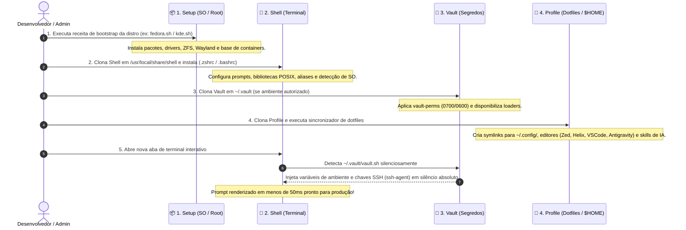

# 🏛️ O Quarteto de Produtividade (Universal Environment Architecture)

> Manifesto unificado de arquitetura, governança e contratos de responsabilidade do ecossistema de produtividade pessoal de Gabriel Frigo.

---

## 🧭 Visão Geral & Filosofia

O ecossistema foi concebido para resolver de forma definitiva o atrito entre sistemas operacionais heterogêneos (**Linux**, **FreeBSD**, **Windows**), garantindo que qualquer estação de trabalho possa ser provisionada, personalizada e operada em minutos com **simetria perfeita**, **desempenho instantâneo** e **segurança rigorosa**.

Em vez de um monólito caótico de dotfiles e scripts soltos, o ambiente é estruturado como uma federação de **4 repositórios complementares e desacoplados** — **O Quarteto de Produtividade**:

```mermaid
flowchart TD
    subgraph QUARTET ["🏛️ O Quarteto de Produtividade"]
        SETUP["📦 1. Setup (Público)<br/>• Provisionamento Ativo de SO<br/>• Pacotes de Sistema, Drivers, Kernel<br/>• Jails, Containers (Incus/Podman)<br/>• Cookbook Zero-Clone (GitHub)"]
        SHELL["🐚 2. Shell (Público)<br/>• Motor Interativo de Terminal<br/>• Prompts Ultra-rápidos (&lt; 50ms)<br/>• Aliases e Funções de Linha de Comando<br/>• Targets de SO e Contextos"]
        VAULT["🔐 3. Vault (Privado)<br/>• Chaves SSH / PuTTY PPK<br/>• Segredos e Variáveis .env<br/>• Senhas Wi-Fi e Mapeamento de Hosts<br/>• Loaders Multi-Shell (sh, ps1, cmd, nu)"]
        PROFILE["🎨 4. Profile (Público)<br/>• Dotfiles Declarativos de Usuário<br/>• Editores (Antigravity, VSCode, Zed, Emacs)<br/>• Terminais (Konsole, Windows Terminal)<br/>• Linters, Formatadores e Skills de IA"]
    end

    subgraph HOST ["💻 Sistema Operacional Host (Clean Host)"]
        KERN["⚙️ Kernel, Drivers & Rede"]
        GUI["🖥️ Desktop Wayland (GNOME / KDE)"]
        CLI["📟 Sessão Interativa de Terminal"]
        APPS["📝 IDEs, Editores & Ferramentas"]
    end

    SETUP -->|1. provisiona com privilégios| KERN
    SETUP -->|1. instala pacotes e base| GUI
    SHELL -->|2. energiza a sessão do terminal| CLI
    VAULT -->|3. injeta credenciais em silêncio| SHELL
    VAULT -->|3. provê chaves para ssh-agent| APPS
    PROFILE -->|4. sincroniza dotfiles ($HOME)| APPS
    PROFILE -->|4. provê inteligência e skills| CLI
```

---

## 📋 Matriz de Papéis e Responsabilidades

| Repositório | Visibilidade | Papel Central | Escopo & Privilégios | Modelo de Instalação | Local Canônico |
| :--- | :--- | :--- | :--- | :--- | :--- |
| **[Setup](https://github.com/GabrielFrigo4/setup)** | Público | **1. O "COMO" (Sistema)**: Provisionamento de pacotes, drivers, containers, hypervisors e serviços base. | Nível SO / Privilegiado (`root` / `sudo` / `ELEVATE` / Admin) | **Cookbook Efêmero (Zero-Clone)**: Execução direta via GitHub web ou `curl \| sh`. | Efêmero / Não requer clone residente |
| **[Shell](https://github.com/GabrielFrigo4/shell)** | Público | **2. A "INTERAÇÃO" (Linha de Comando)**: Prompts instantâneos, aliases, cascading de editores e funções POSIX. | Nível Shell / Sessão (disponível para todos os usuários e `root`) | **Residente do Sistema**: Clonado e atualizado via `git pull` contínuo. | `/usr/local/share/shell` ou `~/.shell` |
| **[Vault](https://github.com/GabrielFrigo4/vault)** | **Privado** | **3. O "SEGREDO" (Cofre Criptográfico)**: Chaves SSH/PuTTY, tokens de API, credenciais Wi-Fi e endpoints de hosts. | Usuário Restrito (Permissões estritas `0700` e `0600`, zero-leakage) | **Residente Privado**: Clonado exclusivamente em máquinas autorizadas. | `${HOME}/.vault` |
| **[Profile](https://github.com/GabrielFrigo4/profile)** | Público | **4. O "O QUÊ" (Identidade)**: Dotfiles declarativos, editores, terminais, linters, links de sync e skills portáteis de IA. | Nível Usuário (`$HOME`, zero privilégios administrativos) | **Residente Sincronizado**: Cloned no `$HOME`, sincronizado via links simbólicos (`ln -sf`). | `~/.config/profile` ou `~/.profile-repo` |

---

## 🔄 Fluxo Canônico de Boot da Máquina (5 Etapas)

Ao inicializar uma nova máquina física, máquina virtual ou ambiente limpo, o ciclo de vida segue uma sequência estrita:



---

## 🏛️ Invariantes & Padrões Universais de Engenharia

Todos os 4 repositórios aderem rigorosamente aos mesmos padrões arquiteturais de Clean Code e governança:

### 1. Os 18 Princípios de Engenharia
Baseados nos 17 Princípios UNIX (*The Art of UNIX Programming*, Eric S. Raymond, 2003) somados ao 18º Princípio fundamental:
- **A Regra da Soberania do Usuário (*Rule of User Sovereignty*):** Nenhuma automação, script ou loader deve sobrescrever variáveis ou configurações pré-existentes do usuário sem consentimento explícito. Ferramentas intencionais do usuário (`doas`, `paru`, `hx`, `eza`, `rg`, `bat`) têm prioridade sobre utilitários genéricos.

### 2. Padrão Exclusivo de Comentários Estruturais (Regra do Não-Vazamento)
- **Código Autoexplicativo:** Comentários explicativos inline triviais são proibidos.
- **Dois Níveis Canônicos:**
  - **Seções Principais (32 `=`):**
    ```sh
    ### ================================
    ### NOME DA SECAO PRINCIPAL
    ### ================================
    ```
  - **Subseções (32 `-`):**
    ```sh
    ### --------------------------------
    ### Nome da Subsecao
    ### --------------------------------
    ```
  - **Regra do Não-Vazamento:** O texto do título DEVE ter no máximo 32 caracteres (total de 36 colunas com `### `) e JAMAIS vazar além da régua divisora.

### 3. Taxonomia Estrita de Nomenclatura
- **`kebab-case` público:** Comandos, aliases e funções destinados à invocação interativa (`vault-keys`, `vault-perms`, `update-all`, `open-helix`).
- **`_snake_case` privado:** Funções internas de infraestrutura, bootstrapping e variáveis locais temporárias (`_as_root`, `_detect_os`, `_vault_dir`).
- **`SNAKE_CASE` maiúsculo:** Variáveis globais de ambiente e constantes (`PATH`, `SHELL_REPO_DIR`, `VAULT_DIR`).

### 4. Permissões Canônicas em 4 Dígitos Octais
- `chmod 0755`: Diretórios e scripts executáveis públicos (`Setup`, `Profile`, `Shell`).
- `chmod 0644`: Dotfiles estáticos, documentações e arquivos de configuração públicos.
- `chmod 0700`: Diretórios privados e scripts executáveis com dados sensíveis (`Vault`).
- `chmod 0600`: Chaves privadas SSH, PuTTY PPK, tokens e arquivos `.env` (`Vault`).
- `chmod 0440`: Arquivos de autorização do sistema operacional (`/etc/sudoers.d/*`, `doas.conf`).

### 5. Governança Autônoma com IA e Quality Gates
- Todo repositório do ecossistema possui:
  - `.githooks/pre-commit` executável e atômico para validar integridade, sintaxe e formatação antes do commit.
  - `.agents/rules/principles.md` com diretrizes de engenharia específicas do seu domínio.
  - `.agents/skills/` com runbooks cognitivos padronizados (`universal-*`, `proactive-guardian`, `deep-investigation`).

---

## 🔗 Links dos Repositórios Federados

- 📦 **[Setup (Provisionamento de Sistema)](https://github.com/GabrielFrigo4/setup)**
- 🐚 **[Shell (Motor Interativo de Terminal)](https://github.com/GabrielFrigo4/shell)**
- 🔐 **[Vault (Cofre Criptográfico & Segredos)](https://github.com/GabrielFrigo4/vault)**
- 🎨 **[Profile (Dotfiles, Editores & IA)](https://github.com/GabrielFrigo4/profile)**
