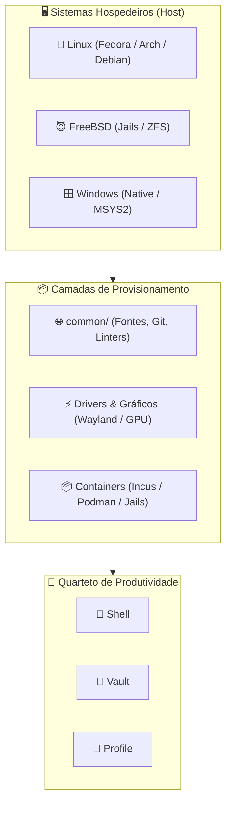

# 📦 Universal Setup Environment

> Repositório público de provisionamento de sistema operacional, receitas atômicas de infraestrutura, drivers de hardware, containers e estações de trabalho limpas (_Clean Host_). Componente de sistema do **Quarteto de Produtividade**.

---

### 🏛️ O Quarteto de Produtividade

[](https://github.com/GabrielFrigo4/setup)
[](https://github.com/GabrielFrigo4/shell)
[](https://github.com/GabrielFrigo4/vault)
[](https://github.com/GabrielFrigo4/profile)

> 📖 **Arquitetura Unificada do Ecossistema:** Conheça a matriz completa de responsabilidades, ciclo de boot e segregação de privilégios em [ENVIRONMENT.md](ENVIRONMENT.md).
> 📜 **Princípios de Engenharia & Infraestrutura:** Conheça os 18 princípios e as 14 regras de Clean Code em [PRINCIPLES.md](PRINCIPLES.md).

---

### 🖥️ Sistemas Operacionais Suportados


-Supported-purple?logo=gitforwindows&logoColor=white>)

### 🎨 Interfaces Gráficas & Tecnologias Host




---

## 🧠 Filosofia: O "Clean Host" e o Modelo Cookbook (Zero-Clone)

O **Setup** provê a fundação do sistema operacional com privilégios administrativos (`root` / `sudo` / `ELEVATE`):

1. **"Clean Host" (Isolamento Extremo):** O sistema nativo (o _host_) permanece o mais puro possível. Ele provê apenas a interface gráfica Wayland, drivers de hardware, utilitários essenciais e a camada de virtualização/containers. Bancos de dados e runtimes de projetos vivem em Containers (Incus, Podman, Docker) ou Jails (FreeBSD).
2. **Zero Dependência de Clone:** Concebido como um **Catálogo de Receitas Modular (Cookbook)**. Você não precisa clonar este repositório para utilizá-lo. Navegue pelos arquivos diretamente na interface web do GitHub ou execute receitas pontuais via terminal.
3. **Idempotência Rigorosa:** Cada receita pode ser executada uma, duas ou dez vezes seguidas produzindo o mesmo estado estável.

---

## 📂 Estrutura do Projeto

- **[`setup.sh`](setup.sh)** — **Orquestrador de Provisionamento:** Entrypoint CLI para receitas interativas (`doctor`, `test`, `audit` e perfis).
- **[`common/`](common/README.md)** — **Receitas Universais:** Fontes, linters, editores, git e provisionamento do ecossistema compartilhados entre Linux, FreeBSD e Windows.
- **[`freebsd/`](freebsd/README.md)** — **FreeBSD Nativo:** Ferramentas comuns (`common/`), containers (Jails & Bastille), desktop Wayland (KDE Plasma 6) e servidores.
- **[`linux/`](linux/README.md)** — **Distribuições Linux & Cloud:** Workstations (Fedora, Arch, Debian), servidores, containers (Incus & Podman) e WSL2.
- **[`windows/`](windows/README.md)** — **Windows & MSYS2:** Ferramentas e engenharia reversa nativas (`native/`) e ambiente MSYS2 (`msys2/` UCRT64).
- **[`scripts/`](scripts/README.md)** — Utilitários de compilação local (`build/`), conversão de arquivos (`convert/`), automações de registro do Windows (`windows/`) e auditoria contínua (`audit/`).
- **[`docs/`](docs/README.md)** — Documentação técnica da infraestrutura do host (`BOOTSTRAP.md`, `CONTAINERS.md`, `HYPERVISORS.md`, `BSD.md`, `LINUX.md`, `WINDOWS.md`).

---

## 🚀 Como Usar via GitHub (Zero-Clone)

```sh
curl -fsSL "https://raw.githubusercontent.com/GabrielFrigo4/setup/main/linux/desktop/fedora/desktop/gnome.sh" | sh

curl -fsSL "https://raw.githubusercontent.com/GabrielFrigo4/setup/main/common/fonts/fonts.sh" | sh

./setup.sh
```

---

## 🧪 Quality Gates & Ganchos Git (.githooks)

Para habilitar a validação de arquitetura e verificação de Markdown antes de cada commit:

```sh
chmod 0755 .githooks/pre-commit
git config core.hooksPath .githooks
```

Para executar a validação estática e qualidade manualmente:

```sh
python3 scripts/audit/all.py
```

---

## 🔗 Integração com o Quarteto de Produtividade

Após provisionar a máquina hospedeira com o **Setup**:

1. Instale o motor interativo de linha de comando com o **[Shell](https://github.com/GabrielFrigo4/shell)**.
2. Clone seu cofre de credenciais e chaves criptográficas com o **[Vault](https://github.com/GabrielFrigo4/vault)**.
3. Clone e sincronize seus dotfiles e assistentes de IA com o **[Profile](https://github.com/GabrielFrigo4/profile)**.
