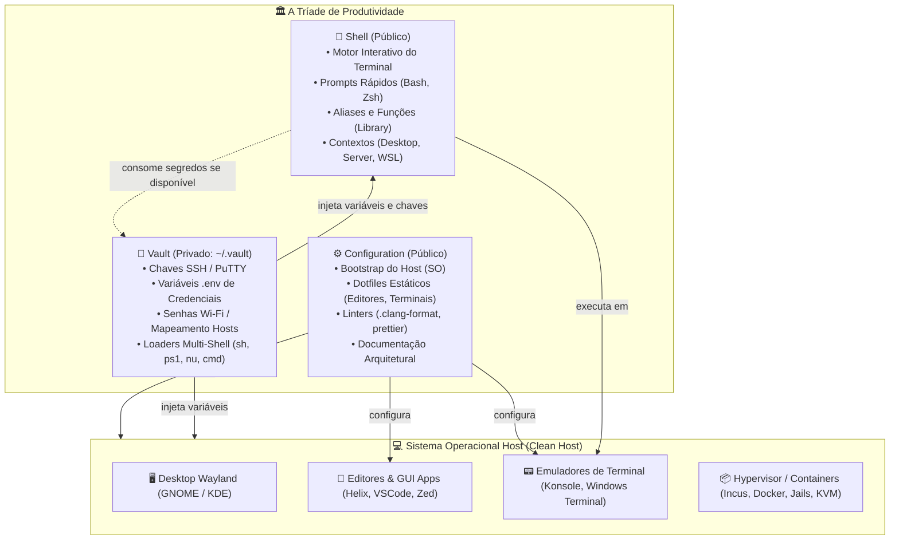

# 🏛️ A Arquitetura da Tríade de Produtividade

Este documento formaliza a arquitetura e as fronteiras de responsabilidade entre os 3 repositórios que compõem o ambiente de trabalho e desenvolvimento unificado.

---

## 🎯 A Divisão de Responsabilidades

---

## 📋 Matriz de Responsabilidades

| Aspecto                 | `Configuration`                                           | `Shell`                                      | `Vault`                                            |
| :---------------------- | :-------------------------------------------------------- | :------------------------------------------- | :------------------------------------------------- |
| **Visibilidade**        | Público (GitHub)                                          | Público (GitHub)                             | **Privado** (GitHub/Local)                         |
| **Natureza**            | **Cookbook / Catálogo de Receitas** e Dotfiles Estáticos  | Motor Dinâmico (Runtime e Linha de Comando)  | Dados Sensíveis e Carregadores Atômicos            |
| **Local de Instalação** | **Zero-Clone** (Acesso direto pelo GitHub / Cópia & Cola) | `/usr/local/share/shell` ou `~/.shell`       | `${HOME}/.vault`                                   |
| **Público-Alvo**        | Consulta web e setup pontual de softwares                 | Nova sessão aberta de terminal               | Injeção de credenciais sob demanda                 |
| **Tolerância a Falhas** | Receitas idempotentes e atômicas                          | Degrada graciosamente se o Vault não existir | Audita permissões (`0600`/`0700`) e protege chaves |

---

## 🔄 Fluxo de Boot e Integração

1. **Instalação do SO e Aplicação de Receitas (`Configuration`):**
    - O usuário instala o sistema base (Fedora, FreeBSD ou Windows).
    - Acessa o repositório pelo GitHub e executa as receitas atômicas desejadas em `bootstrap/` (ex: `bootstrap/linux/desktop/fedora/desktop/gnome.sh`, `bootstrap/freebsd/desktop/system/system.sh`).
    - O sistema ganha utilitários essenciais, drivers, ZFS, interface gráfica e containers.

2. **Instalação dos Dotfiles de Softwares (`Configuration`):**
    - Os arquivos declarativos de editores e ferramentas (`software/editors/`, `software/tools/`) são aplicados no host.

3. **Clonagem dos Repositórios Ativos:**
    - O `Shell` é clonado para `/usr/local/share/shell` e instalado via `sh install.sh --context desktop`.
    - O `Vault` é clonado em `~/.vault` e protegido com permissões restritas.

4. **Sessão de Terminal Interativa:**
    - O terminal inicia carregando `Shell/core/environment.sh`.
    - O Shell detecta o SO e contexto, e verifica se `~/.vault/vault.sh` existe.
    - O Vault exporta variáveis de ambiente de forma silenciosa.
    - O tema e o prompt são renderizados em menos de 50ms.
